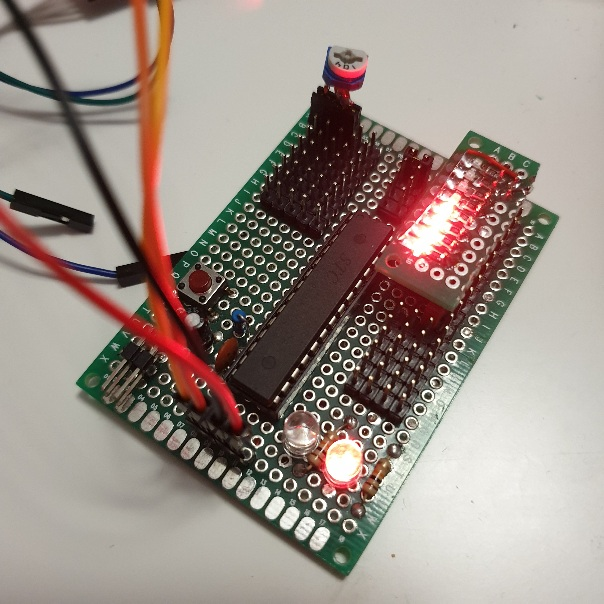

# MCS-51 Sandbox #

STC/IAP/IRC 8051 MCU sandbox.

Start with installing `sdcc`.

Next, run `sh install_stcgal.sh`, this will create python virtualenv
 and install stcgal.

### stcgal: ###

* https://github.com/grigorig/stcgal

### online 8051 assembler: ###

* http://www.8051projects.info/onlineasm.php

### My STC15W Board

